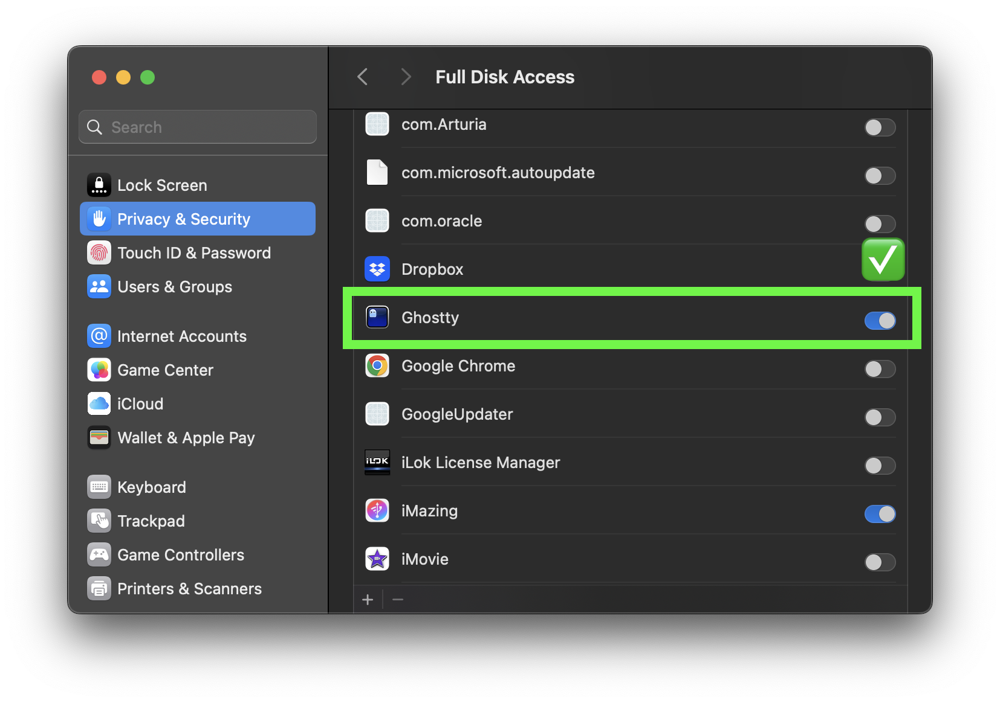

idig
====

[](https://github.com/akiomik/idig/actions/workflows/ci.yml)
[](https://codecov.io/github/akiomik/idig)

A tool for extracting files from iPhone backups.

## Limitations

* macOS only
* Unencrypted backups only

## Installation

Pre-built binaries are available for download from [the release page](https://github.com/akiomik/idig/releases/latest).

## Usage

### Prerequisites

1. Grant Full Disk Access to your terminal application:
   - Open System Settings → Privacy & Security → Full Disk Access
   - Add and enable your terminal application (Terminal.app, iTerm2, etc.)



### Basic Usage

1. Locate your iPhone backup directory:

```bash
ls ~/Library/Application\ Support/MobileSync/Backup
```

2. Search for files in the backup using `idig search`:

```bash
idig --backup-dir ~/Library/Application\ Support/MobileSync/Backup/XXXXXXXX-XXXXXXXXXXXXXXXX \
     search --domain-contains com.apple.news \
            --path-contains Documents
```

3. Extract files from the backup using `idig extract`:

```bash
idig --backup-dir ~/Library/Application\ Support/MobileSync/Backup/XXXXXXXX-XXXXXXXXXXXXXXXX \
     extract --domain-contains com.apple.news \
             --path-contains Documents \
             --output extracted-files
```

### Command Options

```
Usage: idig --backup-dir <BACKUP_DIR> <COMMAND>

Commands:
  search   Search for files based on various criteria
  extract  Extract files based on search criteria
  help     Print this message or the help of the given subcommand(s)

Options:
  -b, --backup-dir <BACKUP_DIR>  iPhone backup directory path (containing Manifest.db)
  -h, --help                     Print help
  -V, --version                  Print version
```

#### Search Command

```
Search for files based on various criteria

Usage: idig --backup-dir <BACKUP_DIR> search [OPTIONS]

Options:
      --domain-exact <DOMAIN_EXACT>        Exact domain match
      --domain-contains <DOMAIN_CONTAINS>  Partial domain match
      --path-exact <PATH_EXACT>            Exact path match
      --path-contains <PATH_CONTAINS>      Partial path match
      --or                                 Use OR logic instead of AND (default is AND)
  -h, --help                               Print help
```

#### Extract Command

```
Extract files based on search criteria

Usage: idig --backup-dir <BACKUP_DIR> extract [OPTIONS] --output <OUTPUT>

Options:
  -o, --output <OUTPUT>                    Output directory for extracted files
      --domain-exact <DOMAIN_EXACT>        Exact domain match
      --domain-contains <DOMAIN_CONTAINS>  Partial domain match
      --path-exact <PATH_EXACT>            Exact path match
      --path-contains <PATH_CONTAINS>      Partial path match
      --or                                 Use OR logic instead of AND (default is AND)
  -h, --help                               Print help
```
